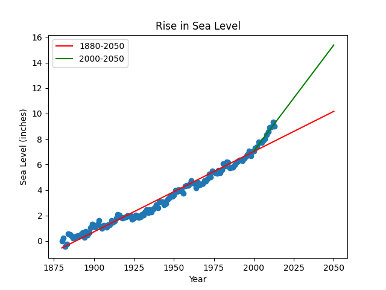

# Sea Level Predictor

Predict and visualize sea level rise using historical data and linear regression.

## Overview
This project analyzes a dataset of global average sea level change since 1880 and predicts sea level change through the year 2050. Using Python, Pandas is used to import and process the data from `epa-sea-level.csv`. The project creates a scatter plot of the data using matplotlib, with the Year column as the x-axis and the CSIRO Adjusted Sea Level column as the y-axis.

The line of best fit for all available data (1880–present) is calculated using the `linregress` function from `scipy.stats` and plotted through the year 2050 to predict future sea level rise. Additionally, a second line of best fit is calculated using only data from the year 2000 onward, also extended to 2050, to show recent trends. The resulting plot includes both regression lines, clear axis labels, and a descriptive title, and is saved as a PNG image. This project helps visualize historical trends and possible future scenarios for global sea level rise.

## Features
- Reads and processes sea level data from a CSV file
- Plots historical sea level data as a scatter plot
- Calculates and displays two regression lines:
  - 1880–2050
  - 2000–2050 
- Saves the resulting plot as a PNG image

## Installation
1. Clone this repository:
	```sh
	git clone https://github.com/AnaCris007/Sea-Level-Predictor.git
	cd Sea-Level-Predictor
	```
2. Install the required Python packages:
	```sh
	pip install -r requirements.txt
	```

## Usage
Run the main script to generate the sea level plot:
```sh
python main.py
```
This will create a file called `sea_level_plot.png` in the project directory.

## Example


## File Structure
- `main.py` — Entry point for running the analysis and plot generation
- `sea_level_predictor.py` — Contains the plotting and regression logic
- `epa-sea-level.csv` — Source data file
- `requirements.txt` — List of required Python packages
- `test_module.py` — Test scripts

## Data Source
The dataset is from the [Environmental Protection Agency (EPA)](https://www.epa.gov/climate-indicators/climate-change-indicators-sea-level).

## Credits
Developed by AnaCris007.
